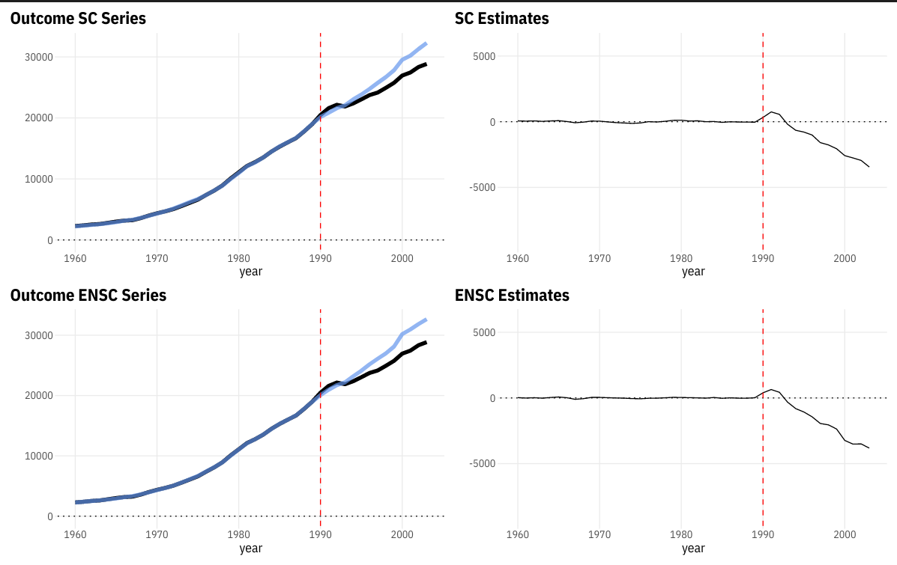

# CVXSynth

Implementations of the original synthetic control (Abadie, Diamond, Hainmueller 2010, 2015) and elastic net synthetic control (Doudchenko and Imbens 2016).

+ [notes](https://apoorvalal.github.io/presentations/pdf/ImbensDoudchenko.pdf)
+ [demo](https://apoorvalal.github.io/posts/09122021_ElasticNetSyntheticControl.html)

## Installation

```R
library(remotes)
install_github("apoorvalal/CVXSynth")
```

## Optimiser

Uses the domain-specific language [CVXR](https://cvxr.rbind.io/) with the
commercial solver `MOSEK` to solve for weights. `MOSEK` is free for academics
and can be installed using installation instructions on their website. Else, an
[alternate
solver](https://cvxr.rbind.io/cvxr_examples/cvxr_using-other-solvers/) can be
passed as the `solv` argument for both `sc_solve` and `en_sc_solve` functions.


## Example

```R
library(pacman)
p_load(data.table, patchwork, ggplot2, CVXSynth, parallel)
theme_set(theme_minimal())
```

### data prep

```R
# %% data prep
load('data-raw/ADH2015.RData')
ADH2015$country = factor(ADH2015$country)
pan = data.table(ADH2015)
pan[, treat := ifelse(country == "West Germany" & year >= 1990, 1, 0)]
treat_name = 'West Germany'
T0 = pan[country == "West Germany" & treat != 1, nunique(year)]
T1 = pan[country == "West Germany" & treat == 1, nunique(year)]

# %% # number of post-treatment periods reshape to wide
wide = pan[, .(country, year, gdp)] |> dcast(year ~ country, value.var = 'gdp')
setcolorder(wide, c('year', treat_name))
y_treat_pre = wide[1:T0, 2] |> as.matrix()
y_ctrl_pre  = wide[1:T0, -(1:2)] |> as.matrix()
```

Input `y_treat_pre` is a $T_0$-vector, and `y_ctrl_pre` is $T_0 \times N$
matrix.

### Original Synthetic Control

`sc_solve` solves for SC weights using constrained regression enforcing
positivity and summation to 1.

```R
# %% synthetic control
ω_sc = sc_solve(y_treat_pre, y_ctrl_pre)
wt_table = data.frame(donor = colnames(y_ctrl_pre), wt = ω_sc)
# %% compute and plot
wide2 = copy(wide)
# impute Y(0) post for treated unit using weights
wide2$y0_sc = as.matrix(wide2[, -(1:2)]) %*% ω_sc
wide2$treat_effect = wide2[[treat_name]] - wide2$y0_sc
# %%
sc_fit = ggplot(wide2, aes(year)) +
  geom_line(aes(y = `West Germany`), size = 2) +
  geom_line(aes(y = y0_sc), size = 2, alpha = 0.7, color = 'cornflowerblue') +
  geom_hline(yintercept = 0, linetype = "dotted") +
  geom_vline(xintercept = 1990, linetype = "dashed", color = 'red') +
  labs(title = "Outcome SC Series", y = "")

# %%
sc_est = ggplot(wide2, aes(year, treat_effect)) + geom_line() +
  geom_hline(yintercept = 0, linetype = "dotted") +
  geom_vline(xintercept = 1990, linetype = "dashed", color = 'red') +
  ylim(c(-9000, 6000)) +
  labs(title = "SC Estimates", y = "")
```

### DI(2016) Elastic Net Synth


```R
# %% DI2016
en_ω = en_sc_solve(y_treat_pre, y_ctrl_pre, 2000)
# %% pseudo-treatment prediction to pick λ
y_ctrl = wide[, -(1:2)] |> as.matrix() # all control units in matrix
lambdas = 10^seq(-1, log10(max(y_ctrl)), length.out = 10)
# %% # for small number of donors, can compute for all ; in other cases, pick randomly?
# takes ~8 mins
system.time(
 lam_choices <- mclapply(1:ncol(y_ctrl),
                      pick_lambda, y_ctrl,
                      10^seq(-1, log10(max(y_ctrl)), length.out = 20),
                      T0 = T0,
                      mc.cores = 6 # parallelise across 6 cores
  )
)
# %% # tabulate best lambda and pick the mode
(lam_chosen = lam_choices |> as.numeric() |> table()  |> sort() |> tail(1) |> names() |>
  as.numeric() |> round(2)
)
# 2517.62
```

```R
en_ω = en_sc_solve(y_treat_pre, y_ctrl_pre, lam_chosen)
# %% compute treatment effects and plot
wide3 = copy(wide)
# impute Y(0) post for treated unit using weights
wide3$y0_hat_en = as.matrix(cbind(1, wide3[, -(1:2)])) %*% en_ω
wide3$treat_effect = wide3[[treat_name]] - wide3$y0_hat_en
# %%
ensc_fit = ggplot(wide3, aes(year)) +
  geom_line(aes(y = `West Germany`), size = 2) +
  geom_line(aes(y = y0_hat_en), size = 2, alpha = 0.7, color = 'cornflowerblue') +
  geom_hline(yintercept = 0, linetype = "dotted") +
  geom_vline(xintercept = 1990, linetype = "dashed", color = 'red') +
  labs(title = "Outcome ENSC Series", y = "")

# %%
ensc_est = ggplot(wide3, aes(year, treat_effect)) + geom_line() +
  geom_hline(yintercept = 0, linetype = "dotted") +
  geom_vline(xintercept = 1990, linetype = "dashed", color = 'red') +
  ylim(c(-9000, 6000)) +
  labs(title = "ENSC Estimates", y = "")
```

### Visualise estimates

```R
# %% compare fig
(sc_fit | sc_est) / (ensc_fit | ensc_est)
```



### Compare Weights

```R
# %% comparing weights
wt_table2 = data.frame(
  donor = c('intercept', colnames(y_ctrl_pre)),
  wt_sc = c(0, round(ω_sc, 2)) ,
  wt_en =      round(en_ω, 2))
wt_table2
```

|donor       | wt_sc|  wt_en|
|:-----------|-----:|------:|
|intercept   |  0.00| 296.98|
|Australia   |  0.00|   0.00|
|Austria     |  0.32|   0.27|
|Belgium     |  0.00|   0.03|
|Denmark     |  0.00|   0.00|
|France      |  0.04|   0.05|
|Greece      |  0.10|   0.13|
|Italy       |  0.06|   0.28|
|Japan       |  0.00|   0.00|
|Netherlands |  0.00|   0.01|
|New Zealand |  0.00|  -0.04|
|Norway      |  0.03|   0.09|
|Portugal    |  0.00|   0.00|
|Spain       |  0.00|  -0.06|
|Switzerland |  0.11|   0.01|
|UK          |  0.00|   0.00|
|USA         |  0.34|   0.25|
